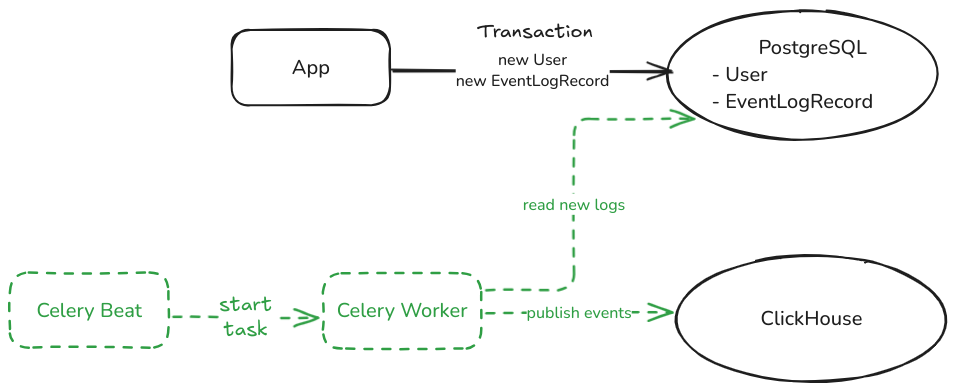

# Die Hard

This is a project with a test task for backend developers.

You can find detailed requirements by clicking the links:
- [English version](docs/task_en.md)
- [Russian version](docs/task_ru.md)

Tech stack:
- Python 3.13
- Django 5
- pytest
- Docker & docker-compose
- PostgreSQL
- ClickHouse

## Installation

Put a `.env` file into the `src/core` directory. You can start with a template file:

```
cp src/core/.env.ci src/core/.env
```

Run the containers with
```
make run
```

and then run the installation script with:

```
make install
```

## Tests

`make test`

## Linter

`make lint`


## Technical solution

The architecture of this project follows the Transactional Outbox pattern to ensure reliable event processing and logging. The key components include:

- **Application (Django):** Handles user requests and writes logs into the EventLogRecord table in PostgreSQL.
- **PostgreSQL (Outbox Storage):** Stores event logs temporarily before they are processed.
- **Celery Worker:** Periodically reads and processes events from the Outbox table.
- **ClickHouse (Log Storage):** Receives and stores structured event logs for analytics and monitoring.
- **Redis (Celery Broker):** Facilitates task queuing and asynchronous processing.

*This design ensures that logs are first persisted in a durable store (PostgreSQL) before being asynchronously processed and transferred to ClickHouse. The use of Celery workers prevents data loss and improves system reliability.*


